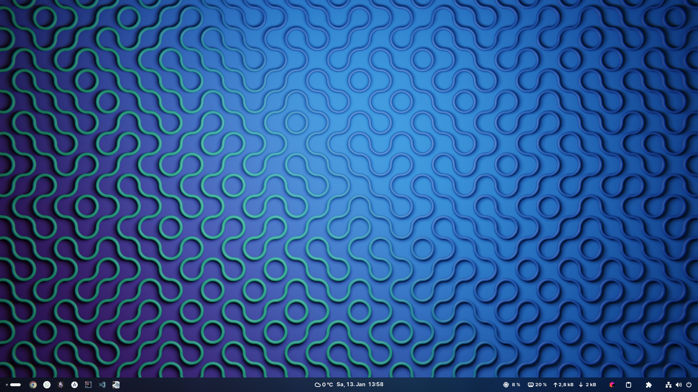

## Desktop

Background by [Pramod Tiwari](https://unsplash.com/@pramodtiwari) on [Unsplash](https://unsplash.com/photos/W3kxCizLWvo)

### GNOME Shell Extensions:

- [App Icons Taskbar](https://extensions.gnome.org/extension/4944/app-icons-taskbar/)

- [Blur my Shell](https://extensions.gnome.org/extension/3193/blur-my-shell/)

- [Burn My Windows](https://extensions.gnome.org/extension/4679/burn-my-windows/)

- [Caffeine](https://extensions.gnome.org/extension/517/caffeine/)

- [Custom Hot Corners - Extended](https://extensions.gnome.org/extension/4167/custom-hot-corners-extended/)

- [Desktop Icons NG (DING)](https://extensions.gnome.org/extension/2087/desktop-icons-ng-ding/)

- [Dotspaces](https://extensions.gnome.org/extension/5347/dotspaces/)

- [Extension List](https://extensions.gnome.org/extension/3088/extension-list/)

- [GSConnect](https://extensions.gnome.org/extension/1319/gsconnect/)

- [Just Perfection](https://extensions.gnome.org/extension/3843/just-perfection/)

- [Pano - Clipboard Manager](https://extensions.gnome.org/extension/5278/pano/)

- [Quick Settings Tweaker](https://extensions.gnome.org/extension/5446/quick-settings-tweaker/)

- [Removable Drive Menu](https://extensions.gnome.org/extension/7/removable-drive-menu/)

- [Rounded Window Corners](https://extensions.gnome.org/extension/5237/rounded-window-corners/)

- [Tiling Assistant](https://extensions.gnome.org/extension/3733/tiling-assistant/)

- [Weather O'Clock](https://extensions.gnome.org/extension/5470/weather-oclock/)

### Themes:

- [adw-gtk3](https://github.com/lassekongo83/adw-gtk3)

- [Fluent-icon-theme](https://github.com/vinceliuice/Fluent-icon-theme)

## Terminal

### Zsh plugins:

- [zsh-autosuggestions](https://github.com/zsh-users/zsh-autosuggestions)

- [zsh-syntax-highlighting](https://github.com/zsh-users/zsh-syntax-highlighting)

### Zsh theme:

[powerlevel10k](https://github.com/romkatv/powerlevel10k)

---

**7 Things You MUST DO After Installing Fedora 36** - *TechHut*
